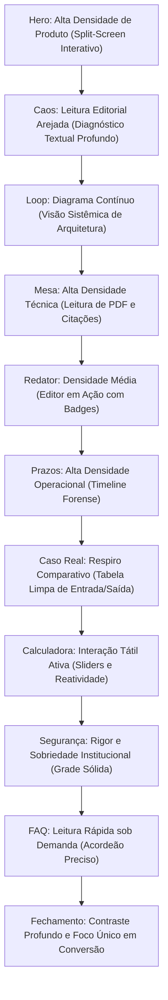

# COMPOSITION_SYSTEM.md — Linguagem de Composição e Ritmo Editorial

> **Status:** Especificação Oficial de Arquitetura de Layout (Etapa 4)  
> **Conformidade:** Alinhado com `AI_WEBSITE_ANTI_PATTERNS.md`, `DESIGN_SYSTEM_SPEC.md` e os princípios da skill `impeccable`.  
> **Objetivo:** Estabelecer uma linguagem visual contínua para o `dendrixcrm.com.br`, eliminando a sensação de "11 blocos aleatórios empilhados" e transformando a página em uma narrativa editorial fluida.

---

## 1. Princípios Estruturais de Composição

### 1.1. Alinhamento Predominante à Esquerda (Assimetria Editorial)
- **Regra:** Mais de 75% da página adota alinhamento à esquerda. O alinhamento à esquerda respeita o fluxo natural de leitura ocidental (varredura em "F" ou "Z"), permitindo absorção ágil de argumentos jurídicos complexos.
- **Quando usar centralizado:** A centralização é reservada **exclusivamente** para 3 momentos cirúrgicos de quebra de ritmo:
  1. O Eyebrow e H1 de transição do *Loop do Caso* (Seção 03).
  2. A introdução da *Calculadora Interativa* (Seção 08).
  3. O bloco de *Chamada Final / Closing CTA* (Seção 11).

### 1.2. Largura Máxima de Linha (Measure / Comprimento de Leitura)
- **Parágrafos e Subheadlines:** Largura máxima rigorosamente limitada a **640px** (`max-w-2xl` ou aproximadamente 65 a 75 caracteres por linha). Linhas mais longas geram fadiga óptica e abandono; linhas mais curtas quebram o pensamento excessivamente.
- **Headings (H1 e H2):** Largura máxima de **780px** (`max-w-3xl`), garantindo impacto visual sem quebras desengonçadas.

---

## 2. Relação Texto vs. Produto (Proporção de Equilíbrio)

Nas seções onde o produto é demonstrado (Hero, Pilares e Estudo de Caso), a página divide-se em proporções assimétricas calculadas:

```
┌───────────────────────────────────────────────┬───────────────────────────────────────────────────────────────┐
│ COLUNA DE COPY E CONTEXTO (40% a 45%)         │ COLUNA DE DEMONSTRAÇÃO DO PRODUTO (55% a 60%)                 │
│                                               │                                                               │
│ • Eyebrow institucional                       │ • Macro-recorte em alta definição                             │
│ • H2 em serifa contemporânea                  │ • Detalhe do PDF / Editor / Alerta                            │
│ • Parágrafo de dor ou benefício               │ • Tags interativas de citação [Fls. 47]                       │
│ • Bullets descritivos específicos             │ • Superfície elevada com borda sutil                          │
└───────────────────────────────────────────────┴───────────────────────────────────────────────────────────────┘
```

- **Por que essa proporção:** Em SaaS técnico, o produto é o principal argumento probatório. O texto não deve competir em área com a interface; ele deve servir de guia explicativo para o que os olhos estão vendo na tela do Dendrix.

---

## 3. Como Evitar o "Efeito Cartela / Stacked Cards"

Sites amadores de IA colocam cada seção dentro de uma "cartela" retangular cinza com bordas arredondadas e sombra difusa, gerando um efeito monótono de caixas empilhadas.

### Diretrizes Anti-Cartela do Dendrix:
1. **Separação por Cadência de Espaço Negativo:** Em vez de mudar a cor de fundo a cada dobra, a distinção entre seções é obtida pela variação do respiro vertical (`80px` a `128px`). O espaço em branco é um elemento ativo de design.
2. **Linhas Divisórias Ultrafinas (Hairline Dividers):** Uso pontual de divisórias de `1px` em `--border-hairline` (`#E2E8F0`) com largura controlada (`max-w-5xl mx-auto`), sem gritar na tela.
3. **Alternância de Textura de Fundo:** Apenas 2 tons de fundo em toda a Home:
   - Base Primária: `--bg-page` (`#FBFBFA` - marfim papel nobre).
   - Base de Contraste Suave: `--bg-surface-subtle` (`#F4F4F2`), usada com parcimônia apenas na Calculadora e no FAQ.
   - Base de Encerramento: `--bg-surface-dark` (`#0B0F17`), restrita à Seção 11 e Footer.

---

## 4. Alternância de Densidade e Ritmo Vertical

A rolagem da página simula uma **conversa consultiva de alto padrão**:



---

## 5. Regras para o Produto Ultrapassar o Contêiner (Bleed & Framing)

- **No Hero:** O Split-Screen ocupa uma largura estendida (`max-w-[1360px]`), expandindo-se além do contêiner padrão de texto (`1280px`). Isso gera grandiosidade e amplitude visual sem quebrar a harmonia.
- **Nos Pilares (Seções 04, 05 e 06):** A interface nunca fica solta flutuando no vazio. Ela é contida em uma moldura de janela com cabeçalho sutil (três pontos de controle mínimos em cinza neutro e título do arquivo `processo-1002341.pdf` ou `minuta-replica.docx`), sinalizando contexto de software real.
- **Borda de Contenção:** Toda tela do produto possui borda perimetral de `1px solid var(--border-hairline)` para não "sangrar" de forma desordenada sobre o fundo marfim.
