# RESEARCH.md — Síntese Profunda de Mercado, Concorrência e Benchmarks

> **Objetivo:** Mapear os padrões da indústria jurídica brasileira e internacional, dissecar as práticas de conversão de SaaS modernos e consolidar aprendizados para posicionar o **Dendrix CRM** com autoridade, clareza e diferenciação estética radical.

---

## 1. O Mercado Jurídico Brasileiro e Concorrentes Diretos

O mercado brasileiro de software jurídico é maduro, porém saturado de soluções que nasceram na era pré-nuvem ou nos primeiros anos de SaaS (2010–2018). As plataformas dominantes construíram fortes barreiras de dados, mas hoje sofrem com dívida técnica, interfaces congestionadas e uma tentativa artificial de incorporar inteligência artificial como adereço de marketing.

### 1.1 ADVBOX (`advbox.com.br`)
- **Posicionamento & Hero:** *"Software jurídico completo. Para a gestão do seu escritório de advocacia."* Promete conectar todas as áreas em um único ecossistema. O design utiliza tons escuros de azul profundo com vidro fosco (*glassmorphism*) e um carrossel visual.
- **Público:** Foco em escritórios digitais e bancas de médio/grande porte com ênfase em controladoria jurídica e pontuação por tarefas (Taskscore).
- **Tratamento da IA:** Criou personas com nomes próprios (*Justin-e* para intimações judiciais, *Donna* para assistente conversacional, *Flowter* para automação de tarefas). 
- **O que faz bem:**
  - Prova social massiva em números (+5.000 escritórios, +80.000 usuários, +5 milhões de processos).
  - Educação de mercado densa (livros gratuitos, eventos, comunidade "ADVBOX Nation", premiação "Top 100 Advogados").
- **O que faz mal:**
  - Linguagem excessivamente corporativa e orientada a métricas de controladoria rígida, o que assusta advogados autônomos ou pequenos escritórios que buscam alívio e agilidade.
  - A IA parece um conjunto desconexo de "robôs temáticos", gerando sensação de complexidade de configuração.

### 1.2 Projuris ADV (`projuris.com.br/adv/`)
- **Posicionamento & Hero:** *"Software Jurídico para Gestão de Escritórios de Advocacia. Centralize processos, prazos, clientes, financeiro..."* Segmentou a oferta em "Projuris ADV Start" (autônomos até 5 usuários, checkout self-service) e "Projuris ADV" (escritórios consolidados com consultoria dedicada).
- **Tratamento da IA:** Foco em automação de rotinas de captura de andamentos e leitura de diários oficiais.
- **O que faz bem:**
  - Estruturação técnica exemplar para SEO e IA generativa (uso pioneiro de metadados GEO/GEM com dicas explícitas para crawlers de ChatGPT, Gemini e Perplexity).
  - Divisão explícita de planos e jornadas entre o autônomo e a média banca.
- **O que faz mal:**
  - Design visual datado, estilo portal institucional tradicional corporativo.
  - Promessas genéricas ("centralize tudo", "ganhe agilidade", "mais controle"), sem transmitir a sensação tangível de um produto moderno e refinado.

### 1.3 Astrea / Aurum (`aurum.com.br/astrea/`)
- **Posicionamento & Hero:** *"Prático, inteligente e funcional. Tenha mais tranquilidade na advocacia com o software jurídico Astrea."* 
- **Chamada de Seção Central:** *"Você advoga. O Astrea organiza."*
- **Tratamento da IA:** IA voltada para identificação de prazos em publicações e tradução de "juridiquês" em resumos fáceis para o cliente.
- **O que faz bem:**
  - Foco emocional na "tranquilidade" e na redução da ansiedade do advogado.
  - Abordagem de aquisição self-service consolidada (Teste grátis de 10 dias sem cartão).
  - Ferramentas públicas de atração com tráfego massivo de SEO (Calculadora de Prazos Processuais no CPC).
- **O que faz mal:**
  - A promessa central *"Você advoga. O Astrea organiza"* tornou-se um clichê batido na advocacia brasileira.
  - A interface, embora limpa, apoia-se em ilustrações vetoriais e screenshots convencionais que não transmitem o poder de uma ferramenta de ponta.

### 1.4 Legal One / Thomson Reuters (`thomsonreuters.com.br`)
- **Posicionamento:** Solução corporativa pesada que reúne conteúdo editorial (Revista dos Tribunais), gestão e jurisprudência.
- **O que faz bem:** Autoridade de marca centenária e respeito institucional inquestionável entre os grandes escritórios.
- **O que faz mal:** Barreira de entrada altíssima, ausência de testes self-service, navegação labiríntica e dependência total de vendedores corporativos em processos morosos de aquisição.

---

### 1.5 Diagnóstico Competitivo Brasil: O Padrão a Superar

```mermaid
flowchart TD
    subgraph Padrão Brasil Atual
        A["Hero Clichê: 'Software jurídico completo'"] --> B["Promessa Vaga: 'Tenha controle total'"]
        B --> C["Screenshots Estáticos em Molduras de Notebook"]
        C --> D["IA como Feature Acessória (Chatbot Flutuante)"]
        D --> E["CTAs Disputados: Fale com Vendedor vs Teste Grátis"]
    end
    subgraph O Espaço do Dendrix
        F["Hero Específico: Contexto do Caso + IA Integrada"] --> G["Promessa Operacional: Do Caos à Decisão sem Repetição"]
        G --> H["Produto Vivo em Ação (Streaming, OCR, Autos)"]
        H --> I["IA Contextual: Grounding com Citação de Página"]
        I --> J["Clareza Cirúrgica + Transparência Imediata"]
    end
```

- **O que todos estão fazendo igual:**
  1. Todos usam o mesmo título: *"Software jurídico completo para o seu escritório"*.
  2. Todos mostram o mesmo painel com gráficos de pizza e listas de tarefas.
  3. Todos tratam a IA como um adereço ou um assistente de conversa genérico.
- **Onde existe o espaço para o Dendrix:**
  1. **Especificidade Radical:** Sair do genérico "gestão de escritório" e atacar o problema real: a fragmentação de contexto que gera ansiedade e perda de prazos.
  2. **Produto como Protagonista:** Mostrar a interface real trabalhando (lendo autos, grifando páginas, redigindo peças com dados do processo).
  3. **Estética Superior:** Abandonar o visual de software governamental dos concorrentes e adotar a elegância sóbria de um SaaS moderno e respeitoso.

---

## 2. LegalTechs Internacionais: Lições de Produto e Storytelling

| Plataforma | Headline / Posicionamento | Tratamento de IA | Aprendizado Crucial para o Dendrix |
| :--- | :--- | :--- | :--- |
| **Clio** (EUA/Canadá) | *"The #1 Legal Practice Management Software"* / **Clio Duo** | IA integrada nativamente ao CRM (sem trocar de aba ou colar contexto manual). | **IA Contextual Embutida:** A IA é forte porque acessa os autos, contatos e faturamento já registrados na plataforma. |
| **Harvey** (EUA) | *"Professional Class AI"* / *"Build a Frontier Legal Organization"* | Assistentes especializados por tipo de prática (*Litigation, Transactional*), *Vault* e *Spaces*. | **Sobriedade e Autoridade:** Tipografia serifada de alto padrão, paleta marfim/preto, sem ilustrações infantis ou cores fluorescentes. Trata o advogado com respeito intelectual. |
| **Spellbook** (EUA/Canadá) | *"Draft and review contracts 10x faster with AI right in Microsoft Word"* | Agente associado (*Spellbook Associate*) que analisa múltiplos documentos e sugere cláusulas. | **Estar onde o advogado trabalha:** Em vez de forçar um ambiente estranho, a IA atua no fluxo natural da redação jurídica. |
| **Legora / Leya** (Europa) | *"The AI-native workspace for law firms and legal teams"* | *Playbooks* estruturados de análise e *Tabular Review* comparativo de autos e documentos. | **Revisão Tabular & Rigor:** Transformar montes de PDFs em tabelas de fatos e contradições com citação de fonte. |

---

## 3. Benchmarks de SaaS Moderno (Fora do Universo Jurídico)

### 3.1 Linear (`linear.app`)
- **Princípio:** *"The issue tracking tool you'll actually enjoy using."* Construído com obsessão por velocidade, atalhos de teclado e estética refinada.
- **Design & Motion:**
  - Escala tipográfica rigorosa baseada em Inter com hierarquia limpa.
  - Microinterações que respeitam a física (aceleração e desaceleração suaves, nunca lineares mecânicas).
  - Ausência de animações puramente decorativas: todo movimento serve para indicar estado ou direcionar o foco visual.
- **Transferibilidade para o Dendrix:** O advogado gasta horas em frente à tela; uma interface com ritmo visual calmo, sem estresse cromático e com alta previsibilidade operacional gera retenção imediata.

### 3.2 Attio (`attio.com`)
- **Princípio:** *"The CRM for agentic revenue."* Reconstruiu a categoria de CRM afirmando que sistemas antigos forçam as pessoas a trabalhar para eles em vez de trabalharem para as pessoas.
- **Storytelling:** Utiliza o contraste radical entre o "absurdo da entrada manual de dados" e a fluidez de um modelo de dados conectado automaticamente por grafos de relacionamento.
- **Transferibilidade para o Dendrix:** Analogia perfeita com a advocacia. O advogado passa horas cadastrando dados repetidos em várias abas; o Dendrix deve se posicionar como o CRM que conecta esses pontos automaticamente.

### 3.3 Ramp (`ramp.com`) e Stripe (`stripe.com`)
- **Princípio do Hero de Alta Conversão:**
  - **Teste de Especificidade:** Nenhuma headline pode ser genérica a ponto de servir para o concorrente.
  - **Prova Acoplada à Promessa:** A afirmação de valor é imediatamente seguida por um componente visual interativo do produto e dados concretos auditáveis.
  - **Jornada em Sequência de Conversa:** Cada dobra de rolagem responde à objeção seguinte que o comprador formularia em uma reunião de vendas.

---

## 4. Escritórios de Advocacia de Elite: Os Códigos Visuais da Confiança

A análise dos maiores escritórios jurídicos do país (**Mattos Filho**, **TozziniFreire**, **Machado Meyer**) revelou princípios fundamentais para não parecer uma "brincadeira de IA":

1. **Uso Generoso do Espaço Negativo (White Space):**
   - Transmite calma, maturidade e controle. A poluição visual e o amontoado de cards em degradê são marcas registradas de produtos amadores.
2. **Tipografia Institucional Equilibrada:**
   - O uso de uma tipografia serifada sofisticada em títulos ou subtítulos evoca história, segurança jurídica e precisão documental, enquanto uma sans-serif neutra de alta legibilidade sustenta a interface e os dados.
3. **Fotografia Humana Real vs. Gráficos Vetoriais Genéricos:**
   - Escritórios de ponta exibem pessoas reais em ambientes sóbrios e concentrados. No Dendrix, devemos fugir de fotos de banco com advogados segurando martelos de madeira americanos (*gavels*) ou robôs apertando as mãos de humanos.

---

## 5. YouTube / Expert Learnings: Frameworks de CRO e Hero Design

A análise de especialistas renomados em conversão e posicionamento de SaaS (**Peep Laja / CXL**, **Harry Dry / Marketing Examples**, **Anthony Pierri & Rob Kaminski / Fletch PMM**) forneceu as seguintes diretrizes determinísticas:

### Framework 1: O Teste dos 5 Segundos (Peep Laja)
- O visitante médio decide em até 5 segundos se aquela página faz sentido para ele.
- **A regra:** A dobra superior (*above the fold*) precisa responder a três perguntas em português simples, sem metáforas abstratas:
  1. *O que é isso?* (Categoria clara: CRM Jurídico com IA Contextual).
  2. *Para quem é?* (Advogados autônomos e pequenos escritórios que sofrem com processos desarticulados).
  3. *O que eu ganho com isso?* (Controle total de prazos, leitura rápida de autos e redação assistida sem perder o contexto).

### Framework 2: A Página como Conversa de Vendas Consultiva (Fletch PMM)
Uma landing page eficaz não é um folheto de funcionalidades; é a reprodução ordenada de uma demonstração de vendas bem-sucedida:
1. **Hero:** Declaração de categoria + promessa principal + visual do produto em contexto real.
2. **Diagnóstico da Dor:** Exposição explícita do custo do improviso (prazos descobertos tarde, abas espalhadas, prompts vazios de IA).
3. **Apresentação da Solução:** Apresentação do ecossistema Dendrix como o elo que unifica gestão e inteligência.
4. **Demonstração Modular por Caso de Uso:** Como o produto age em cada momento da rotina (organizar o caso -> ler os autos -> redigir a peça -> conferir antes de protocolar).
5. **Neutralização de Objeções:** Segurança de dados, conformidade ética com a OAB, garantia de que a decisão final é do advogado.
6. **CTA de Fechamento:** Entrada simples, sem fricção e com caminho claro para teste ou demonstração.

### Framework 3: Princípio de Motion Funcional
- **Regra de Retenção Visual:** Nenhuma tela deve permanecer estática por longos períodos sem um microevento perceptível que recompense a atenção do usuário (uma digitação em streaming, um marcador de página se acendendo, um alerta de prazo sendo ordenado).
- **Sem Loops Infinitos sem Sentido:** Animações não devem rodar em looping infinito aleatório; devem ilustrar uma tarefa com início, meio e fim (ex: upload do PDF dos autos -> processamento com citação de página -> relatório pronto).
