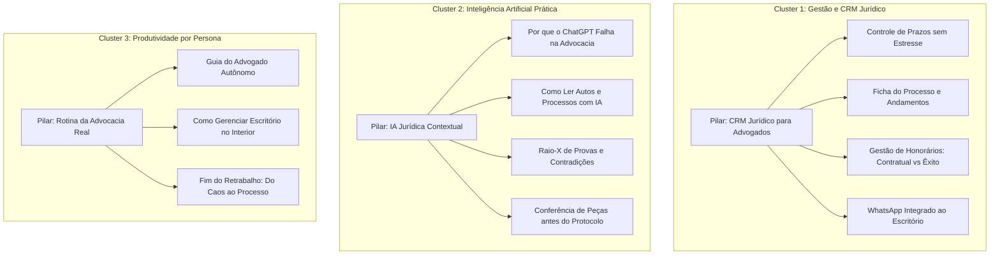

# SEO.md — Arquitetura de Conteúdo Orgânico e SEO Estratégico

> **Objetivo:** Mapear a intenção de busca do advogado brasileiro, dissecar as táticas de aquisição orgânica dos concorrentes e desenhar a arquitetura de páginas e clusters de conteúdo que alimentarão o domínio `dendrixcrm.com.br` e seu blog futuro.

---

## 1. Mapeamento de Intenção de Busca e Matriz de Palavras-Chave

O mercado jurídico no Brasil pesquisa com três níveis de maturidade e intenção. A estratégia do Dendrix é focar primariamente na **alta intenção comercial (fundo de funil)** e na **dor operacional aguda (meio de funil)**, evitando disputar termos puramente acadêmicos sem conversão.

### Nível 1: Fundo de Funil (Alta Intenção Comercial / Decisão Ativa)
*O advogado sabe que precisa de uma ferramenta e está comparando ou procurando uma solução específica para comprar:*

| Termo de Busca | Intenção do Usuário | Tipo de Página Ideal no Dendrix | Abordagem de Diferenciação |
| :--- | :--- | :--- | :--- |
| `software jurídico` | Comparação e contratação de sistema de gestão. | Home (`dendrixcrm.com.br`) ou Landing Comercial dedicada. | Contrapor sistemas pesados e burocráticos ao CRM com IA Contextual. |
| `CRM jurídico` | Busca de software focado em clientes, processos e relacionamento. | Página de Solução: CRM Jurídico. | Destacar o vínculo cliente ↔ processo ↔ WhatsApp nativo. |
| `software para advogado autônomo` | Autônomo buscando algo simples, barato e que não exija equipe de TI. | Landing por Persona: Advogado Solo / Autônomo. | Enfatizar simplicidade, baixo custo operacional e fim dos prazos esquecidos. |
| `sistema para pequeno escritório de advocacia` | Sócio buscando organizar 2 a 8 pessoas sem burocracia excessiva. | Landing por Persona: Pequenos Escritórios. | Foco em eliminação de gargalos, delegação com contexto e alívio do fundador. |
| `IA para advogados` / `inteligência artificial jurídica` | Advogado curioso ou frustrado com o ChatGPT querendo ferramenta jurídica real. | Página de Solução: IA Jurídica Contextual. | Expor o diferencial: grounding rígido, citação de página e integração com os autos. |
| `Dendrix CRM` / `Dendrix é bom?` / `Dendrix login` | Busca institucional e de reputação da marca. | Home / Institucional / FAQ de Confiança. | Transmitir segurança institucional, conformidade ética com a OAB e dados no Brasil. |

---

### Nível 2: Meio de Funil (Dor Operacional Específica / Busca de Eficiência)
*O advogado está sofrendo com um sintoma específico e busca um método ou ferramenta para saná-lo:*

| Termo de Busca | Intenção do Usuário | Estrutura de Conteúdo Proposta |
| :--- | :--- | :--- |
| `controle de prazos processuais` | Medo constante de perder prazos; busca de método ou planilha para gerenciar. | Guia Prático no Blog + Apresentação do Módulo de Prazos do Dendrix. |
| `como organizar processos no escritório` | Escritório crescendo e se perdendo entre pastas, planilhas e e-mails. | Artigo pilar com templates de workflow e introdução ao Kanban / Ficha do Processo. |
| `calculadora de prazos processuais CPC` | Ferramenta utilitária de cálculo de dias úteis e prazos de recursos. | Ferramenta Gratuita interativa no site (Wedge de atração de tráfego, padrão Aurum). |
| `como analisar autos de processo em PDF` | Advogado recebendo autos volumosos e gastando dias para mapear fatos e provas. | Conteúdo demonstrando a Mesa Jurídica (Mapa do Processo com IA). |
| `revisão de petição antes de protocolar` | Preocupação com erros materiais bobos (CPF, datas, pedidos esquecidos). | Artigo focado no Conferidor Pré-Protocolo. |

---

### Nível 3: Topo de Funil (Pesquisa e Formação / Conteúdo Educacional)
*Conteúdos informativos de atração ampla (reservados para a consolidação do Blog na Etapa 9):*
- Prazos do Novo CPC em esquemas visuais;
- Tabela de honorários da OAB por estado e como cobrar honorários contratuais e de êxito;
- Modelos estruturados de petição inicial, contestação e réplica;
- Como atender clientes pelo WhatsApp sem perder o histórico do processo.

---

## 2. Estrutura de Clusters de Conteúdo (Topic Clusters)

Para construir autoridade perante o Google e os motores de IA generativa (AEO/GEO), o Dendrix organizará seu conteúdo em **3 Clusters Pilares**:

---

## 3. Diretrizes Técnicas de SEO On-Page e Schema.org

1. **Title Patterns:**
   - Home: `Dendrix CRM | O Software Jurídico com IA Contextual`
   - Páginas de Funcionalidade: `[Nome da Funcionalidade] | Dendrix CRM` (ex: `Gestão de Prazos | Dendrix CRM`)
   - Artigos do Blog: `[Dor ou Pergunta Concreta] — Guia Prático | Dendrix`
2. **Meta Description:**
   - Focada em conversão, benefício concreto e sem enrolação, respeitando o limite de 155 caracteres.
   - Exemplo: *"Conecte clientes, prazos e autos em um só lugar. A IA que já conhece o seu caso antes de redigir a peça. Experimente o Dendrix CRM grátis."*
3. **Structured Data (JSON-LD) Obrigatório:**
   - `Organization`: Nome, URL, logo oficial, links de redes sociais e contato.
   - `SoftwareApplication`: Categoria `BusinessApplication / LegalSoftware`, licença SaaS, suporte a pt-BR.
   - `BreadcrumbList`: Em todas as páginas internas para navegação semântica.
   - `FAQPage`: Na home e nas páginas de produto, indexando as respostas diretamente nas SERPs.
4. **Otimização para Mecanismos Generativos (GEO/AEO):**
   - Criação de `llms.txt` e `robots.txt` amigáveis a crawlers de IA (GPTBot, ClaudeBot, PerplexityBot).
   - Inserção de definições claras e respostas diretas nos primeiros parágrafos dos artigos para facilitar citações em resumos de IA (*AI Overviews* do Google e respostas do Perplexity).
