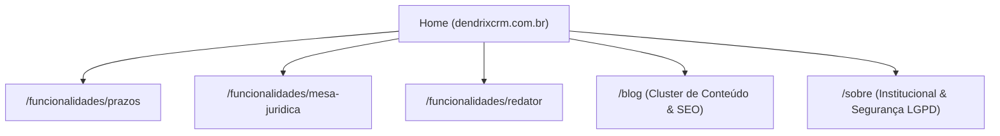

# SITE_PLAN_V0.md — Primeiro Plano Estratégico do Site Dendrix CRM

> **Documento Provisório de Planejamento (Versão 0.1)**  
> **Aviso:** Este documento representa a síntese da pesquisa inicial (Etapa 2) e foi estruturado propositalmente para servir de base para a sessão de alinhamento e sabatina profunda com a skill **`grill-me`**. Nenhuma decisão aberta foi resolvida de forma arbitrária.

---

## A. Objetivo do Site

Construir a presença digital oficial do **Dendrix CRM** (`dendrixcrm.com.br`) como um canal de aquisição de alta conversão, autoridade institucional inquestionável e educação de mercado.

O site deve cumprir uma tríplice missão:
1. **Explicar com Clareza Cirúrgica:** Em menos de 5 segundos, fazer o advogado entender o que é o Dendrix, para quem é e por que ele é fundamentalmente diferente de um chatbot comum.
2. **Provar através do Produto Real:** Exibir o produto em ação, mostrando como ele se integra à rotina do caso e transforma autos caóticos em estratégia.
3. **Gerar Confiança Imediata:** Servir como âncora de credibilidade para quem recebe uma abordagem comercial do Dendrix e pesquisa a empresa antes de decidir.

---

## B. Público-Alvo (ICPs)

- **ICP A — Advogado Solo / Autônomo:**  
  Precisa de organização urgente, sofre com ansiedade de prazos, não tem tempo para cursos complexos de software e busca um copiloto que retire o trabalho braçal da frente para que ele foque em atender clientes e peticionar com segurança.
- **ICP B — Pequeno Escritório (2 a 8 advogados, destaque para o interior):**  
  Banca que lida com autos digitalizados densos, processos em múltiplas comarcas, precisa delegar tarefas sem perder o raciocínio estratégico e quer crescer a carteira sem multiplicar o caos interno.

---

## C. Posicionamento Sugerido

> **"O CRM jurídico onde a gestão e a inteligência do caso vivem no mesmo lugar."**

O Dendrix ocupa o vácuo perfeito deixado pelo mercado:
- **Não é o sistema legado pesado:** Que exige semanas de treinamento, cobra implantações caras e trata a advocacia como uma fábrica burocrática de preencher formulários.
- **Não é a IA genérica solta:** Que alucina jurisprudência, não lembra quem é o cliente e exige copiar e colar dezenas de páginas em um chat isolado.
- **É o ambiente integrado:** Onde a ficha do processo, os autos em PDF, as tarefas e a IA cooperam ativamente.

---

## D. Mensagem Principal (Brand Core)

> **"Antes da peça, existe um caso inteiro.  
> O Dendrix organiza. A IA apoia. O advogado decide."**

### Mensagens de Apoio:
1. *“Chega de explicar o mesmo processo para cinco ferramentas diferentes.”*
2. *“Prazos sob controle com contagem regressiva — nunca mais trabalhe no susto.”*
3. *“Autos de 300 páginas mapeados com fatos, provas e contradições citando a página exata.”*
4. *“Petições redigidas no editor com o contexto do seu cliente, conferidas antes de protocolar.”*

---

## E. Arquitetura de Informação Proposta

Para o lançamento inicial, a arquitetura deve ser concisa, sem "páginas fantasmas" para parecer grande.

1. **Home (`/`):** A página principal de conversão, posicionamento e demonstração do ecossistema.
2. **Páginas de Solução / Funcionalidades (Opcionais no V0, prioritárias para SEO):**
   - `/funcionalidades/gestao-de-prazos` (captura tráfego de controle de prazos).
   - `/funcionalidades/mesa-juridica` (captura tráfego de IA jurídica e análise de autos).
   - `/funcionalidades/redator-juridico` (captura tráfego de elaboração de peças).
3. **Blog (`/blog`):** Motor de atração orgânica baseado em artigos práticos de rotina jurídica.
4. **Segurança e Privacidade (`/segurança`):** Detalhamento de LGPD, servidores seguros no Brasil e isolamento de dados.

---

## F. Estrutura Proposta da HOME (Seção por Seção)

| Seção | Nome / Dobra | Objetivo | Mensagem Central | Conteúdo & Elementos | Visual & Direção | Interação & Motion | Prova Necessária | CTA |
| :--- | :--- | :--- | :--- | :--- | :--- | :--- | :--- | :--- |
| **01** | **Hero Principal** | Capturar atenção em 3s, comunicar a categoria e provar o diferencial. | *"Antes da peça, existe um caso inteiro. O CRM jurídico que conecta seus autos, prazos e clientes ao mesmo raciocínio."* | H1 cirúrgico, subheadline clara, CTA duplo (Teste / Demonstração) e badge de conformidade ética OAB. | UI em perspectiva suave mostrando um caso real aberto: prazos à esquerda, autos abertos no centro com grifo de prova e petição à direita. | Entrada staggered das camadas do caso; o grifo na página dos autos pulsa discretamente. | Selo de criptografia e dados no Brasil (LGPD). | `Começar Grátis` / `Ver Demonstração` |
| **02** | **O Diagnóstico da Dor (Custo do Caos)** | Criar ressonância empática imediata com a rotina do advogado. | *"Você não está sem tempo. Você está procurando informação demais em abas que não conversam."* | 4 dores explícitas: 1. Prazo descoberto tarde; 2. Contexto espalhado no WhatsApp; 3. IA genérica sem memória; 4. Contrato da folha em branco. | Contraste visual entre o "caos das 8 abas abertas" versus a "paz da tela única do Dendrix". | Efeito de colapso: as abas espalhadas convergem e se organizam na Ficha do Processo. | Citação textual de dores reais da advocacia. | N/A |
| **03** | **O Ecossistema Dendrix (A Virada)** | Apresentar a tese de produto: o loop completo do caso. | *"O trabalho e a inteligência vivem no mesmo lugar."* | Visão dos 3 pilares: Gestão do Dia a Dia (CRM) -> Leitura e Análise (Mesa Jurídica) -> Redação Assistida (Redator). | Diagrama interativo de fluxo contínuo em 3 etapas conectadas. | Ao passar o mouse ou rolar, a etapa em foco acende e demonstra a tela correspondente. | N/A | `Conhecer o Ecossistema` |
| **04** | **Pilar 1: Prazos e Operação** | Neutralizar o medo do prazo fatal e a desordem diária. | *"Prazos sob controle absoluto. Sem sustos, sem alertas perdidos."* | Widget de contagem regressiva, distinção prazo vs. audiência, sincronia com o processo e timeline. | Interface real do Dashboard de Prazos em alta definição, destacando alertas visuais. | Micro-interação: o prazo "vencendo em 2 dias" exibe a ação necessária com 1 clique. | Telas reais do módulo de prazos já implementado. | N/A |
| **05** | **Pilar 2: A Mesa Jurídica (Raio-X de Autos)** | Gerar o momento "UAU" da demonstração técnica da IA. | *"Transforme 300 páginas de autos em um mapa claro do caso em minutos."* | Upload do PDF -> OCR -> Extração cronológica de pedidos e decisões -> Raio-X de contradições apontando a página exata. | Split-screen cinematográfico: PDF do processo judicial real com marcação na `Página 42` conectada ao card de contradição do Dendrix. | O usuário pode alternar entre abas simuladas (*Partes*, *Fatos*, *Contradições*, *Checklist*). | Grounding visual: indicação transparente do número da página do documento. | `Ver como a IA lê os autos` |
| **06** | **Pilar 3: O Redator Assistido** | Mostrar como a petição nasce sem folha em branco. | *"Escreva junto com a IA, com o contexto do cliente já qualificado."* | Editor Tiptap gerando em streaming bloco a bloco (endereçamento, fatos, pedidos) com revisão inline. | Interface do editor rico com o texto sendo digitado suavemente em streaming, enquanto as variáveis do caso são puxadas da Ficha. | Botões interativos simulados: "Mais formal", "Adicionar tutela", "Ver fundamentação". | Sem invenção de jurisprudência: o Conferidor pré-protocolo valida os dados. | N/A |
| **07** | **Segurança, LGPD e Ética Profissional** | Desarmar a maior objeção jurídica (vazamento de dados / alucinação). | *"Seus dados não treinam modelos públicos. A decisão final é sempre sua."* | Servidores seguros no Brasil, conformidade rigorosa com a LGPD, respeito ao sigilo profissional do Estatuto da OAB. | Grade sóbria e elegante de garantias de infraestrutura e governança. | Ícones discretos de infraestrutura auditada. | Referência a padrões de criptografia e residência em São Paulo. | `Ler nossa política de segurança` |
| **08** | **FAQ de Transparência Radical** | Matar todas as dúvidas técnicas e operacionais que travam a compra. | Respostas diretas e honestas para as perguntas mais difíceis. | Perguntas selecionadas: Substitui o advogado? Precisa instalar? Como funciona em autos escaneados? Posso testar? | Acordeão limpo e rápido, integrado com Schema.org `FAQPage`. | Expansão suave e ágil. | Respostas que respeitam a inteligência do advogado. | N/A |
| **09** | **Chamada Final (CTA)** | Conduzir o visitante qualificado à ação de entrada. | *"Coloque ordem no seu escritório hoje. Teste o Dendrix na prática."* | Benefício final sintetizado, botão principal em destaque, aviso de "sem cartão de crédito". | Fundo sóbrio de alto contraste, tipografia refinada e botão de ação evidente. | Micro-brilho tátil no botão ao passar o mouse. | Garantia de cancelamento simples e suporte humano. | `Experimentar o Dendrix Grátis` |

---

## G. Direção Visual Preliminar

- **Atmosfera:** Editorial, executiva, precisa, lúcida. Afastamento absoluto de elementos de videogame, neon púrpura ou estética de "hackathon".
- **Tipografia em Avaliação:** Híbrida — títulos com serifa contemporânea de autoridade (*Newsreader* ou similar) e corpo/interface em sans-serif de alta legibilidade técnica (*Inter* ou *Plus Jakarta Sans*).
- **Cores:** Paleta neutra refinada (carvão escuro, grafite suave, marfim/off-white) com azul marinho institucional e acentos discretos de contraste funcional (âmbar para prazos de atenção, verde esmeralda sóbrio para itens conferidos).

---

## H. Territórios de Hero para Decisão

1. **Território 1 — O Caso Inteiro Conectado:** Ênfase na sincronia sistêmica entre cliente, processo, autos e IA.
2. **Território 2 — Do Caos ao Controle de Prazos:** Ênfase na erradicação da ansiedade e do risco de perda de prazos.
3. **Território 3 — O Estagiário Sênior Ultra-Organizado:** Ênfase na leitura e conferência de autos volumosos com citação de página.
4. **Território 4 — O Redator com Memória do Caso:** Ênfase na produção jurídica rápida e assistida sem folha em branco.

---

## I. Estratégia de Utilização da Interface Dendrix

- **A Interface como Elemento Dramático:** A landing page não usará capturas estáticas inteiras em baixa resolução dentro de molduras genéricas de MacBook.
- **Técnica de Macro-Recorte (UI Chunks):** Vamos isolar e ampliar os componentes mais poderosos do produto:
  - O card de prazo com contagem regressiva em tempo real.
  - A citação de página `[Pág. 47 - Contestação]` vinculada ao texto da IA.
  - O streaming do editor escrevendo os pedidos da petição.
  - A timeline de andamentos do processo.

---

## J. Estratégia Inicial de Motion

- **Princípio:** O movimento só existe se comunicar uma transformação de estado do software.
- **Tecnologia Prevista (a validar na Etapa 8):** CSS moderno + Framer Motion / Motion para transições de componente, respeitando `prefers-reduced-motion`.
- **Eventos Guiados:** Simular o upload de um PDF que se desdobra em 3 conclusões concretas com referências numeradas.

---

## K. Mobile

- **Mobile First Real:** 
  - O split-screen do hero será empilhado de forma inteligente no smartphone: o título direto e uma visão compactada do card do caso com tabs fáceis de tocar.
  - Navegação simplificada com barra de ação fixa no rodapé para agendamento ou teste rápido.
  - Redução drástica de scripts pesados e garantia de rolagem suave a 60fps em celulares medianos.

---

## L. SEO e Aquisição Orgânica

- Arquitetura limpa estruturada para o App Router do Next.js.
- Metadados semânticos completos em todas as rotas (OpenGraph, Twitter Cards, canonicals).
- Marcação de dados estruturados JSON-LD (`SoftwareApplication`, `Organization`, `FAQPage`).
- Estrutura pronta para suportar os 3 clusters de conteúdo definidos em `SEO.md`.

---

## M. Conversão (CRO)

- **Redução de Risco Imediata:** Texto auxiliar em todos os botões de ação esclarecendo termos ("Sem necessidade de cartão de crédito", "Cancele quando quiser", "Suporte humano por WhatsApp").
- **CTAs Coerentes com a Persona:** Foco no próximo passo lógico do advogado (experimentar sem compromisso ou ver uma demonstração de 5 minutos).
- **Hierarquia de Prova:** Cada promessa funcional é acompanhada do componente visual correspondente da interface que a comprova.

---

## N. Planejamento do Blog

- Estrutura estática de alto desempenho baseada em arquivos Markdown/MDX dentro do projeto (`content/blog/`), programada para implementação na Etapa 9.
- Template de artigo com leitura estimada, autor, data, sumário interativo (*Table of Contents*) e caixas de destaque de jurisprudência/normas.

---

## O. Assets que Precisarão ser Coletados / Produzidos

Para que a implementação visual seja impecável nas etapas posteriores, precisaremos dos seguintes insumos do produto real:
1. **Capturas em Alta Resolução (Figma ou Telas Reais do Dendrix):**
   - Dashboard de Prazos (visão com dados preenchidos de exemplo).
   - Ficha do Processo completa.
   - Tela da Mesa Jurídica / Leitura de Autos com citações.
   - Editor Tiptap com uma petição em redação.
2. **Logotipo Vetorial:** Arquivos `.svg` do logotipo e do ícone/símbolo oficial do Dendrix em versões clara e escura.
3. **Casos / Peças de Exemplo Anônimas:** Trechos de petições e autos despersonalizados para popular os mockups sem expor dados de clientes reais.

---

## P. Informações que Ainda Faltam (Gaps Identificados)

1. **Status exato de release das features de IA:** Quais módulos da Mesa Jurídica já estão ativos em produção no `dendrix.app.br` e quais estão em ambiente de homologação.
2. **Modelo de Preços Oficial:** Se o Dendrix terá tabela de preços transparente na landing page (planos mensais/anuais por usuário) ou se a entrada será 100% via contato comercial e demonstração.
3. **Mecanismo de Onboarding:** O cadastro cria uma conta instantânea para o advogado começar a usar na hora (*product-led*) ou cai em uma fila de validação comercial?

---

## Q. Decisões que Precisam ser Tomadas Com Você (Questions to Resolve)

> [!IMPORTANT]
> **Estas questões serão o núcleo da próxima sessão com a skill `grill-me`:**
> 1. **Qual território de Hero ressoa com maior força com a sua visão de produto?** (Território 1 - Caso Conectado vs. Território 2 - Fim do Caos de Prazos vs. Território 3 - Mesa Jurídica e Leitura de Autos vs. Território 4 - Redator de Peças).
> 2. **Qual é o modelo de conversão prioritário na Home?** Teste Grátis Self-Service (ex: 7 ou 10 dias sem cartão, estilo Astrea) OU Agendamento de Demonstração Guiada com Especialista (estilo LegalTechs B2B)?
> 3. **Exibição de Preços:** Queremos uma seção aberta de planos e preços na Home/Página de Preços ou manter a precificação sob consulta no primeiro momento?
> 4. **Identidade Visual:** Prefere uma abordagem sóbria clássica (com serifa editorial de prestígio estilo Harvey) ou puramente técnica e moderna (sans-serif estilo Linear/Attio)?
> 5. **Foco Geográfico da Linguagem:** O foco imediato no advogado do interior deve ser explícito na copy (linguagem direta e prática de balcão de fórum) ou devemos manter uma comunicação neutra e universal para qualquer advogado do Brasil?
