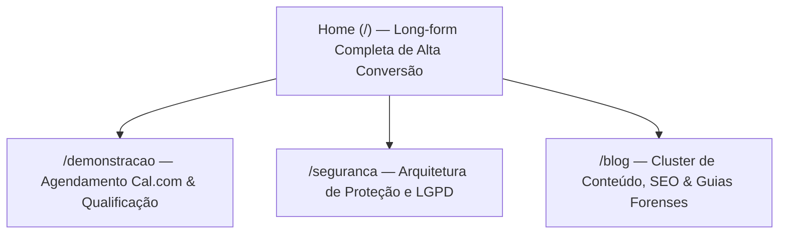

# SITE_PLAN_V1.md — Plano Estratégico Definitivo do Site Dendrix CRM

> **Status:** Documento Oficial de Planejamento (Versão 1.0 — Validado Pós-Sabatina Grill-Me)  
> **Conformidade de Decisões:** Incorpora integralmente as diretrizes vinculantes **DEC-001** até **DEC-019**.  
> **Objetivo:** Estabelecer a arquitetura estratégica, comercial, visual, técnica e narrativa para o desenvolvimento da presença digital do **Dendrix CRM** (`dendrixcrm.com.br`).

---

## 1. Visão Geral e Filosofia de Aquisição

O **Dendrix CRM** (`dendrixcrm.com.br`) é a plataforma oficial de marketing, aquisição, autoridade institucional e educação de mercado do ecossistema Dendrix. A aplicação de produto permanece isolada e operacional em `dendrix.app.br`.

### A Tríplice Missão da Landing Page:
1. **Clareza Imediata (Regra dos 5 Segundos):** Fazer o advogado compreender instantaneamente o que é o produto, como ele se diferencia de softwares legados e chatbots genéricos, e por que a conexão entre gestão e inteligência do caso é transformadora.
2. **Prova Visual Radical Acima da Dobra:** Demonstrar o produto real em ação logo no Hero, mostrando a extração de fatos de autos judiciais em PDF e a elaboração assistida de peças no mesmo fluxo contínuo.
3. **Conversão de Alta Qualificação (Venda Consultiva):** Canalizar visitantes qualificados para uma demonstração técnica prática de 15 minutos com um processo real da banca do advogado, garantindo o "Momento Uau" sem atritos burocráticos.

---

## 2. Perfis de Cliente Ideal (ICPs) e Dores Forenses

### ICP A: Advogado Autônomo / Solo
- **Realidade:** Atua sozinho ou com secretária remota. É ao mesmo tempo o captador, o operador que cumpre os prazos, o leitor de autos volumosos e o administrador financeiro.
- **Dores Críticas Tratadas no Site:**
  - Pânico do prazo fatal esquecido em notas adesivas ou planilhas estáticas.
  - Sobrecarga cognitiva: perder horas lendo 200 a 400 páginas de PDFs mal digitalizados para achar uma única contradição documental.
  - Frustração com o ChatGPT genérico, que alucina precedentes e exige digitar prompts quilométricos explicando quem é o autor e quem é o réu toda vez.
- **Gatilho de Conversão:** *"Ganhe de volta 20 a 30 horas por mês eliminando o trabalho braçal de leitura de autos e minuta de peças."*

### ICP B: Pequenos Escritórios (2 a 8 Advogados, Foco Expressivo no Interior)
- **Realidade:** Bancas estabelecidas com carteira de 150 a 1.000 processos ativos. O sócio sênior teme delegar peças para associados ou estagiários porque a conferência de fatos e documentos toma todo o seu tempo.
- **Dores Críticas Tratadas no Site:**
  - Gargalo de revisão: o sócio precisa reler os autos para saber se o associado deixou passar alguma nulidade ou pedido essencial.
  - Desconexão entre os andamentos recebidos dos tribunais e a execução das tarefas forenses.
  - Autos escaneados de comarcas do interior sem camada de texto pesquisável.
- **Gatilho de Conversão:** *"Padronize a excelência técnica da sua banca com um fluxo onde a IA mapeia os autos, sugere o próximo passo e redige minutas fundamentadas em minutos."*

---

## 3. Posicionamento Oficial, Brand Core e Wedge

### Posicionamento Central
> **"O CRM jurídico onde a gestão da banca e a inteligência dos autos vivem no mesmo lugar."**

### Mensagem Principal (Brand Core)
> **"Antes da peça, existe um caso inteiro.  
> O Dendrix organiza. A IA apoia. O advogado decide."**

### O Wedge de Aquisição (Cavalo de Troia)
O cavalo de troia de aquisição é o **'Fluxo Completo do Caso'**:
- O advogado não acorda de manhã querendo comprar um CRM burocrático (ele já tem traumas de sistemas lentos e engessados).
- O advogado acorda com a dor aguda de ter que **ler 300 páginas de contestação e documentos para redigir uma réplica antes das 23:59**.
- O Dendrix o fisga resolvendo essa dor imediata: lê os autos em PDF, mapeia fatos e contradições com citação de página e redige a minuta no editor em 2 cliques.
- **A virada:** Ele percebe que a IA só faz isso com precisão milimétrica porque o caso já está cadastrado, os prazos já estão computados e os clientes já estão qualificados no CRM Dendrix. O CRM deixa de ser um "fardo de preencher dados" e se torna o cérebro que alimenta a inteligência do escritório.

---

## 4. Mecânica de Conversão e Arquitetura do Funil

Conforme a decisão **DEC-012**, o modelo é **100% Venda Consultiva / Demonstração Guiada**.

```
┌─────────────────────────────────────────────────────────────────────────────────┐
│                           JORNADA DE CONVERSÃO DENDRIX                          │
├──────────────────┬───────────────────────────┬──────────────────────────────────┤
│ Etapa            │ Mecanismo na Landing Page │ Experiência do Visitante         │
├──────────────────┼───────────────────────────┼──────────────────────────────────┤
│ 1. Descoberta    │ Home Long-form + Blog     │ Entendimento do loop do caso e   │
│                  │                           │ prova visual do produto em ação. │
│ 2. Engajamento   │ Calculadora de Horas/ROI  │ Simulação interativa do tempo    │
│                  │                           │ economizado na própria banca.    │
│ 3. Ação (CTA)    │ Botão Principal na Home / │ Abertura do fluxo de agendamento │
│                  │ Rota Dedicada /demonstracao│ com promessa de sessão prática.  │
│ 4. Qualificação  │ Mini-formulário integrado │ Coleta de: Nome, WhatsApp,       │
│                  │ (Cal.com custom wrapper)  │ E-mail e Tamanho do Escritório.  │
│ 5. Agendamento   │ Calendário Cal.com        │ Escolha de dia e hora para call  │
│                  │                           │ de 15 minutos no Google Meet.    │
│ 6. Atendimento   │ WhatsApp Floating Action  │ Canal imediato para quem prefere │
│    Imediato      │ com mensagem estruturada  │ tirar dúvidas antes de agendar.  │
└──────────────────┴───────────────────────────┴──────────────────────────────────┘
```

### A Promessa Irrecusável da Demonstração:
> *"Agende uma demonstração prática de 15 minutos: traga um processo real da sua banca (ou use nosso caso modelo) e veja o Dendrix ler os autos, apontar as contradições e minutar a peça ao vivo diante dos seus olhos."*

---

## 5. Prova Social e Governança de Confiança (Anti-Slop)

Conforme a decisão **DEC-015**, fica expressamente proibido o uso de depoimentos falsos, números inflados ou "avaliações de 5 estrelas" de personagens fictícios.

### Os Pilares Reais de Confiança:
1. **Prova Técnica Não Filtrada (Unfiltered Product Truth):**
   - Demonstração da interface real do Dendrix em altíssima definição (macro-recortes de UI real em vez de mockups genéricos).
2. **O Estudo de Caso Desidentificado:**
   - Um caso judicial cível/trabalhista real despersonalizado (com nomes e números fictícios padrão CNJ), exibindo o trecho do PDF dos autos com grifo real e a respectiva minuta gerada citando as páginas correspondentes.
3. **Transparência Radical de Infraestrutura e LGPD:**
   - Dados armazenados em São Paulo (banco Supabase / AWS `sa-east-1`).
   - Garantia formal de consumo de IA corporativa: **seus dados processuais nunca são usados para retreinamento de modelos públicos**.
   - Criptografia de ponta a ponta (AES-256 e TLS 1.3).
   - Estrita observância aos deveres de sigilo profissional do Estatuto da Advocacia e Código de Ética da OAB.

---

## 6. Arquitetura de Páginas da V1

Conforme a decisão **DEC-018**, o escopo de lançamento é enxuto, potente e focado em retenção de atenção:



1. **Home (`/`):** A espinha dorsal do projeto. Narrativa imersiva que conduz o advogado por todas as etapas de convencimento, com navegação suave por âncoras (`#recursos`, `#como-funciona`, `#calculadora`, `#seguranca`, `#faq`).
2. **Página de Demonstração (`/demonstracao`):** Ambiente focado exclusivamente no agendamento, sem distrações, contendo o formulário de qualificação e o calendário integrado do Cal.com.
3. **Segurança e Privacidade (`/seguranca`):** Detalhamento para sócios e DPOs sobre isolamento de tenancy, criptografia, residência de dados no Brasil e políticas de não-treinamento de IA.
4. **Blog Forense (`/blog`):** Motor de SEO e autoridade orgânica baseado em artigos práticos em Markdown/MDX (`content/blog/`), suportando os 3 clusters definidos em `SEO.md`.

---

## 7. Estrutura Detalhada da HOME (Seção por Seção)

| Seção | Nome / Dobra | Mensagem Principal | Elementos de Copy & UX | Visual & Direção de Arte | Prova do Produto | Ação / CTA |
| :--- | :--- | :--- | :--- | :--- | :--- | :--- |
| **01** | **Hero Principal** | **H1:** *"Dos autos à minuta, com a origem das informações sempre visível."* <br>**Eyebrow:** `CRM JURÍDICO COM INTELIGÊNCIA CONTEXTUAL`<br>**Sub:** *"O Dendrix conecta o contexto do processo à leitura dos autos em PDF, identifica fatos e contradições com referência às páginas e auxilia na redação da peça no mesmo ambiente."* | CTAs: `Agendar demonstração prática` (principal) e `Ver o produto em ação` (secundário). <br>Microcopy: *"15 minutos • Traga um processo da sua banca ou use nosso caso modelo."* <br>Assinatura: *"Antes da peça, existe um caso inteiro. O Dendrix organiza. A IA apoia. O advogado decide."* | **Split-Screen Dinâmico:** PDF dos autos com `Fls. 47` grifada à esquerda -> conector de dados do CRM -> Redator gerando a peça em streaming com tags de fonte à direita. | Interface real funcionando em tela dividida sem abstração. | `Agendar demonstração prática` / `Ver o produto em ação` |
| **02** | **O Custo do Caos (A Dor)** | *"Você não perde tempo porque trabalha pouco. Perde tempo procurando informação em abas que não conversam."* | 3 contrastes brutais da rotina forense: 1. Autos pesados lidos na pressa; 2. Ficha do cliente solta no WhatsApp; 3. Ferramentas genéricas sem contexto persistente. | Composição visual sóbria ilustrando o atrito diário do advogado versus a serenidade da tela única. | Citações e dores literais do cotidiano forense. | N/A |
| **03** | **O Loop do Caso (A Virada)** | *"O primeiro CRM jurídico onde a gestão diária alimenta o raciocínio da IA."* | Explicação visual do loop virtuoso: 1. Entrada do Processo & Prazos -> 2. Leitura e Mapeamento dos Autos -> 3. Redação Assistida com Dados Reais. | Diagrama contínuo e elegante conectando os módulos do Dendrix com micro-interações ao passar o mouse. | Demonstração gráfica da ausência de silos. | `Ver os Recursos` |
| **04** | **Pilar 1: Mesa Jurídica (Leitura de Autos)** | *"Transforme autos volumosos em um mapa claro de fatos e contradições."* | Upload de PDF/autos escaneados (OCR); cronologia automática; extração de teses da parte contrária; citação transparente de folhas. | Macro-recorte da interface da Mesa Jurídica em alta definição, evidenciando a tag `[Fls. 89 - Laudo Pericial]`. | Citação direta de página dos autos em cada apontamento da IA. | N/A |
| **05** | **Pilar 2: Redator Ouro (2 Cliques)** | *"Minutas estruturadas sem folha em branco, com base direta nas informações do processo."* | Geração ágil estruturada em 2 cliques; treinamento em banco de peças de alta técnica forense; editor rico (Tiptap) para revisão inline com autonomia total do advogado. | Interface do editor rico com texto fluindo suavemente e badges laterais indicando a proveniência de cada fato no CRM. | O editor real em streaming com as variáveis do cliente preenchidas. | N/A |
| **06** | **Pilar 3: Prazos, Fórum & Publicações** | *"Publicações de todo o Brasil monitoradas com IA sugerindo o próximo passo processual."* | Acompanhamento nacional integrado via OAB/Diários Oficiais; contagem regressiva visual de prazos; distinção prazo vs. audiência; gestão de honorários e projetos jurídicos. | Card de publicação real com o badge da IA: *"Sugerido: Apresentar Réplica no prazo de 15 dias"*, com botão de ação direta. | Telas reais do dashboard de prazos e timeline forense. | N/A |
| **07** | **Caso Real Desidentificado** | *"Veja como o Dendrix processou um caso judicial real em menos de 4 minutos."* | Estudo de caso guiado (Ação Indenizatória): O problema complexo nos autos -> O que a IA encontrou na contestação -> A minuta da petição pronta para o advogado revisar. | Visualização comparativa "Antes dos Autos vs. Mapa Extraído", demonstrando rigor técnico e economia de esforço. | Processo judicial real despersonalizado com padrão CNJ. | `Quero ver no meu caso` |
| **08** | **Calculadora de Economia / ROI** | *"Descubra quantas horas por mês sua banca recupera eliminando o trabalho braçal."* | Componente interativo com 2 sliders: 1. Processos Ativos no Escritório; 2. Quantidade de Advogados na Banca. Saída dinâmica em tempo real: Horas economizadas/mês + Valor estimado em honorários liberados. | Card elegante de alto contraste com medidor animado e visualização de impacto financeiro e operacional. | Modelo matemático realista baseado em médias de leitura forense e redação. | `Agendar para Recuperar essas Horas` |
| **09** | **Segurança, LGPD e Ética OAB** | *"Seus autos não treinam modelos públicos. A decisão final é sempre sua."* | Pilares de segurança: 1. Servidores em São Paulo (Supabase / AWS); 2. APIs corporativas com retenção zero para treino; 3. Criptografia AES-256; 4. Sigilo estatutário da advocacia respeitado. | Grade sóbria de compromissos éticos e técnicos com ícones limpos e tipografia precisa. | Menção formal a protocolos de segurança e arquitetura em nuvem nacional. | `Conhecer nossa Infraestrutura` |
| **10** | **FAQ de Transparência Radical** | *"Tudo o que você precisa saber antes de agendar uma demonstração."* | Respostas diretas para as dúvidas capitais: 1. A IA substitui o advogado? 2. Como funciona em autos escaneados antigos? 3. Preciso instalar algum programa? 4. Como funciona a demonstração? 5. Meus dados ficam seguros? | Acordeão ágil com Schema.org `FAQPage` integrado para SEO. | Respostas francas e técnicas sem juridiquês evasivo. | N/A |
| **11** | **Chamada Final (Closing CTA)** | *"Coloque ordem no seu escritório e ganhe horas de estratégia. Veja o Dendrix em ação."* | Reiteração da promessa; botão destacado para agendamento do Cal.com; canal direto do WhatsApp para quem precisa de resposta imediata; aviso "Demonstração prática de 15 min com um processo da sua banca". | Bloco final de alto prestígio, fundo carvão profundo, tipografia editorial nítida e botões táteis de alto contraste. | Garantia de atendimento especializado sem pressão comercial agressiva. | `Agendar Demonstração Prática` |

---

## 8. Sistema Visual e Linguagem de Marca

### Tipografia Oficial: "Híbrido Editorial de Prestígio"
- **Títulos e Destaques:** Serifa contemporânea de autoridade (`Newsreader` ou `Playfair Display`). Transmite a gravidade, a solidez e o respeito que a advocacia exige.
- **Corpo de Texto e Interface:** Sans-serif técnica e limpa (`Inter` ou `Plus Jakarta Sans`). Garante legibilidade cristalina em cards de processos, tabelas e parágrafos longos.
- **Metadados e Números Forenses:** Monospaçada neutra (`Geist Mono` ou `JetBrains Mono`) para CNJ de processos, prazos e folhas de autos.

### Paleta Cromática Institucional (Tema Claro Dominante):
- **Base do Site:** Fundo marfim suave / papel nobre (`#FBFBFA` e `#F8F9FA`).
- **Cards e Modais:** Branco puro (`#FFFFFF`) com bordas sutis e precisas (`#E5E7EB`).
- **Tipografia Principal:** Carvão profundo (`#0B0F17` e `#0F172A`), garantindo legibilidade perfeita (contraste superior a 12:1).
- **Acento Primário e Autoridade:** Azul Marinho Institucional (`#0F2B48` e `#1E3A8A`).
- **Acentos Funcionais de Estado:** Âmbar suave (`#D97706`) para prazos e atenção; Verde esmeralda sóbrio (`#059669`) para provas conferidas e validações.

### Tom de Voz: "Pragmático Forense de Alta Autoridade"
- **O que é:** Vocabulário natural de quem conhece a rotina forense ("autos", "contrarrazões", "publicação", "comarca", "balcão", "prazo fatal"), objetivo, elegante e sóbrio.
- **O que NÃO é:** Fica expressamente vetado o juridiquês pedante arcaico ("outrossim", "data maxima venia") e, com igual rigor, o dialeto infantilizado de "startup tech-bro" ("copilot com superpoderes mágicos 🚀"). O Dendrix trata o advogado como a autoridade intelectual e decisória do processo.

---

## 9. Governança e Auditoria Rigorosa de Claims

| Afirmação / Tópico | Classificação Oficial | Regra de Copy no Site |
| :--- | :--- | :--- |
| **"Substitui o advogado"** | ❌ **PROIBIDO** | Nunca utilizar. Posicionar sempre como apoio operacional e copiloto analítico. A decisão é 100% humana. |
| **"Risco Zero / 100% Livre de Erros"** | ❌ **PROIBIDO** | Banido por ferir o Código de Ética da OAB e a realidade da advocacia. Utilizar: *"Redução drástica de falhas humanas com conferência assistida"*. |
| **"Selo Oficial OAB / Parceria OAB"** | ❌ **PROIBIDO** | A OAB não homologa softwares de forma genérica. Usar: *"Conformidade ética com as diretrizes do Estatuto da Advocacia e LGPD"*. |
| **Mesa Jurídica e Leitura de Autos** | ✅ **CONFIRMADO** | Permitido detalhar leitura de PDFs, OCR para escaneados e citação de páginas de autos judiciais. |
| **Acompanhamento de Publicações** | ✅ **CONFIRMADO** | Permitido divulgar cobertura ampla nacional integrada via OAB e diários oficiais com IA sugerindo próximo passo. |
| **Redator Jurídico em 2 Cliques** | ✅ **CONFIRMADO** | Permitido divulgar elaboração de minutas fundamentadas baseadas em banco de peças ouro e dados do CRM. |
| **Segurança e Nuvem em São Paulo** | ✅ **CONFIRMADO** | Permitido detalhar banco de dados Supabase em São Paulo (AWS sa-east-1) e APIs sem retenção de dados para treino. |
| **Depoimentos de Advogados** | ⚠️ **CONDICIONADO** | Apenas depoimentos reais autorizados documentalmente. Na ausência destes na V1, apoiar 100% na prova técnica do produto. |

---

## 10. Roadmap de Próximas Etapas

Com a aprovação formal deste **SITE_PLAN_V1.md**, o projeto avança para as etapas de execução da presença digital:

1. **Etapa 3 — Copywriting Forense Cirúrgico:** Redação textual completa de todas as seções da Home, página `/demonstracao`, `/seguranca` e microcopy de conversão baseada na skill `copywriting`.
2. **Etapa 4 — Engenharia de Design e Componentes:** Construção dos componentes do Design System ("Híbrido Editorial de Prestígio") no Next.js e Tailwind CSS v4 via skill `impeccable`.
3. **Etapa 5 — Desenvolvimento da Dobra Hero e Mockups Dinâmicos:** Implementação do Split-Screen de alta fidelidade com os autos em PDF grifados e o Redator em streaming.
4. **Etapa 6 — Desenvolvimento da Calculadora Interativa de Horas/ROI:** Criação do widget de cálculo dinâmico com sliders reativos e integração com a chamada para ação.
5. **Etapa 7 — Integração do Fluxo de Agendamento (Cal.com + Mini-Formulário):** Conexão do modal/página com captura de dados de qualificação e escolha de horário para a demonstração.
6. **Etapa 8 — Páginas Complementares e Segurança:** Implementação das rotas `/demonstracao` e `/seguranca`.
7. **Etapa 9 — Motor do Blog e Estrutura de Conteúdo:** Configuração do leitor estático de MDX, templates forenses e artigos pilares de SEO.
8. **Etapa 10 — Testes, Otimização de Performance, SEO Técnico e Deploy:** Validação de Core Web Vitals, metadados OpenGraph/Schema.org e deploy oficial na Vercel.
